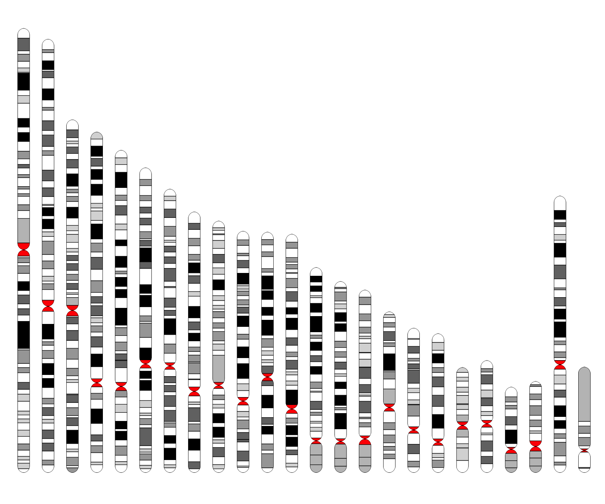
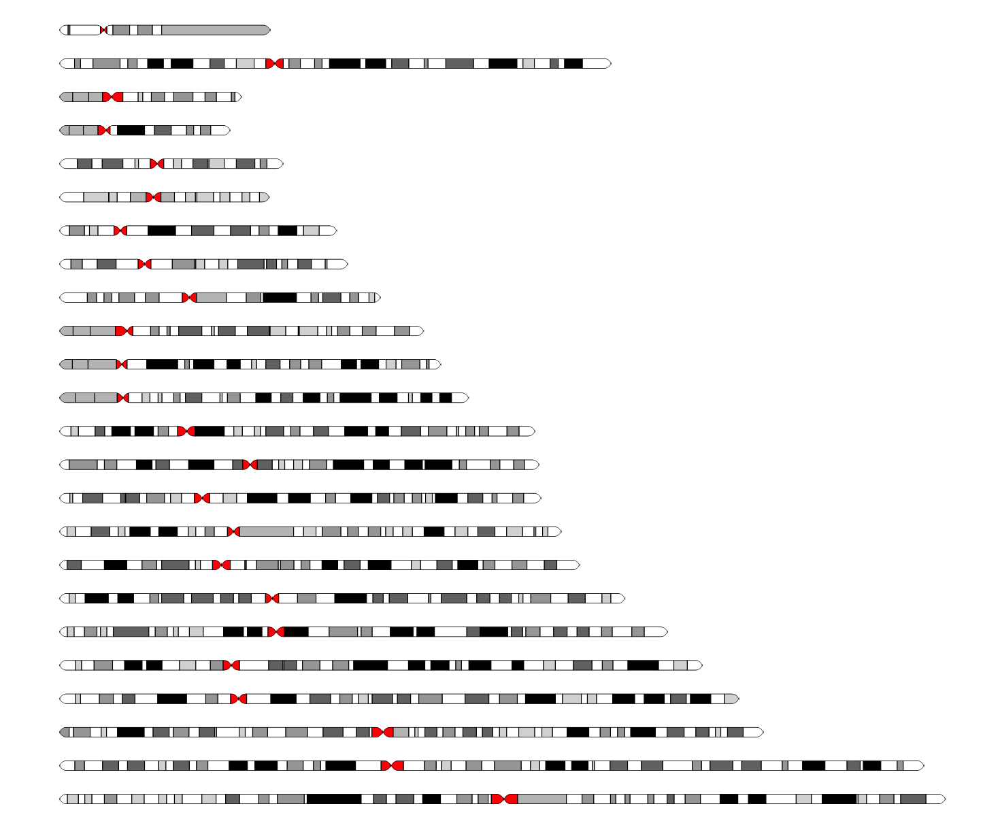
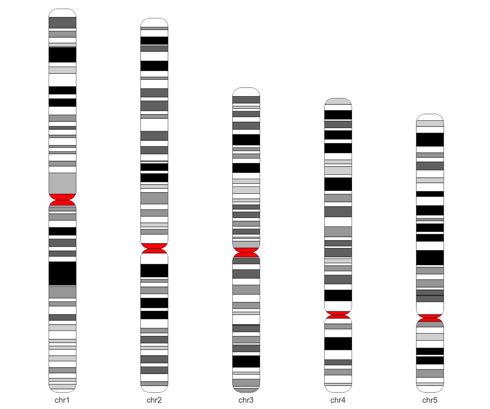
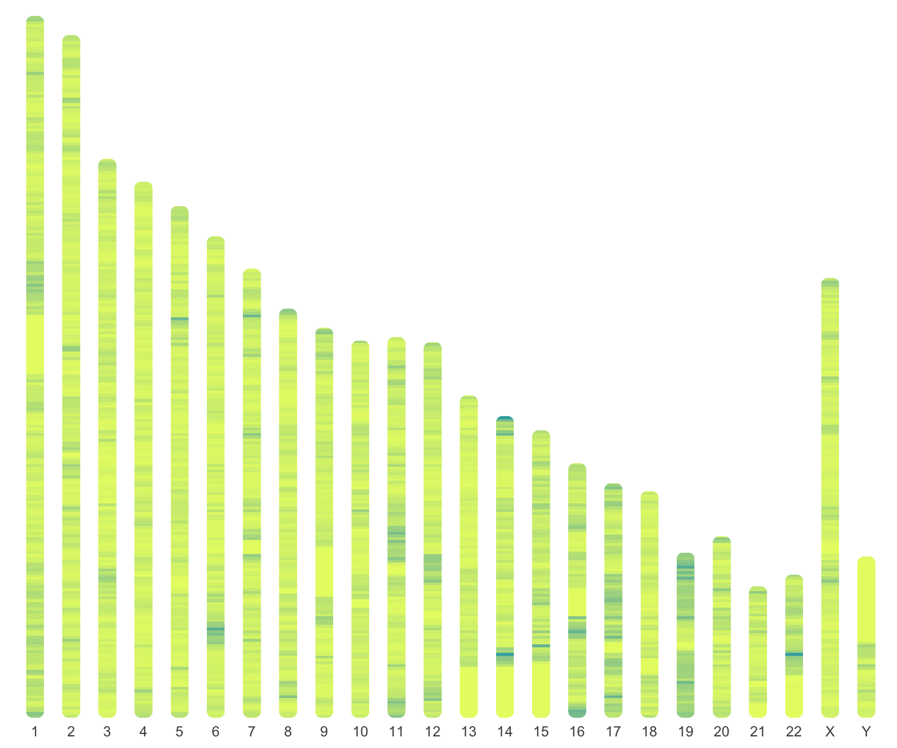
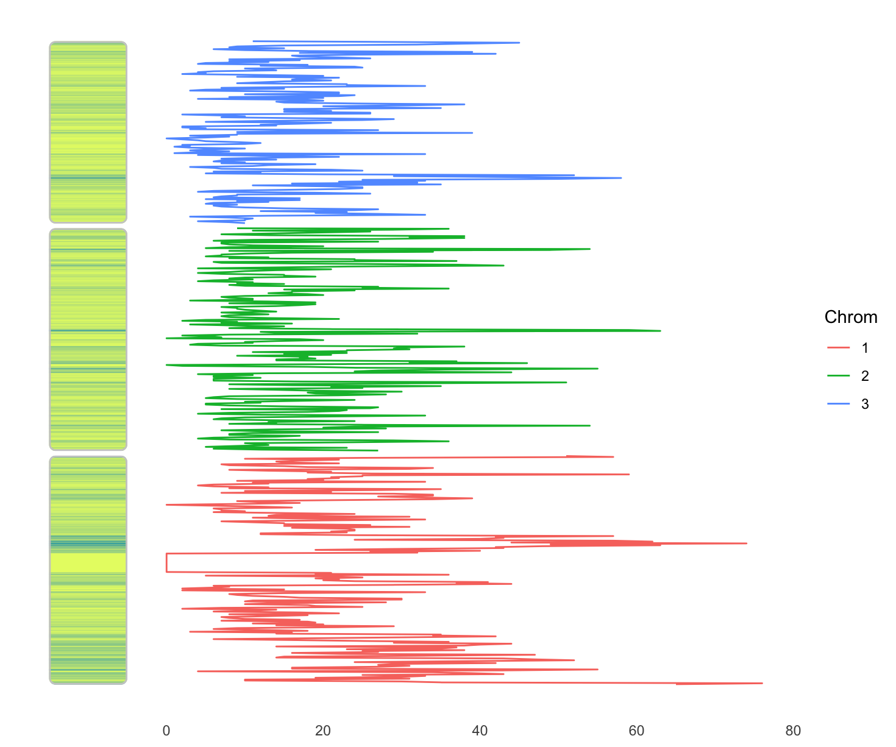
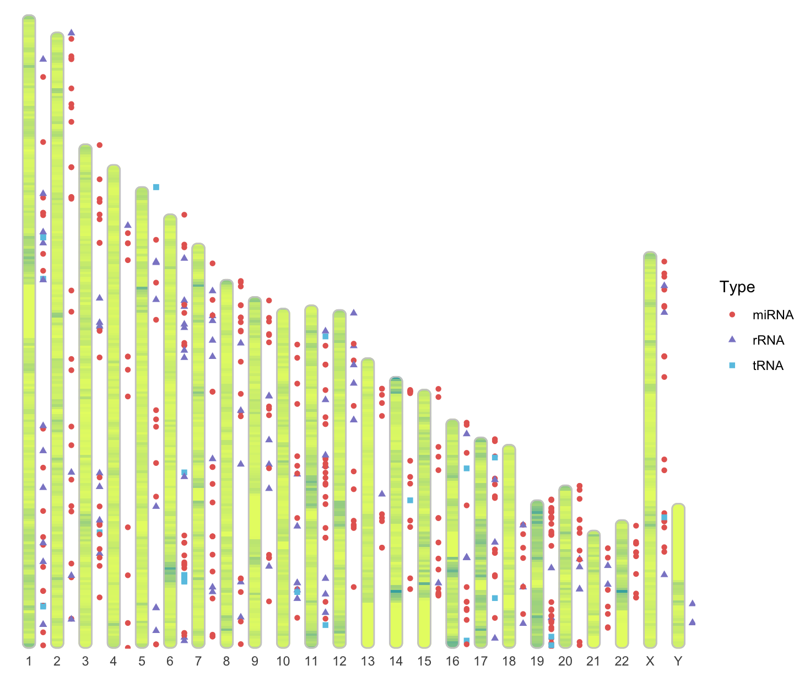
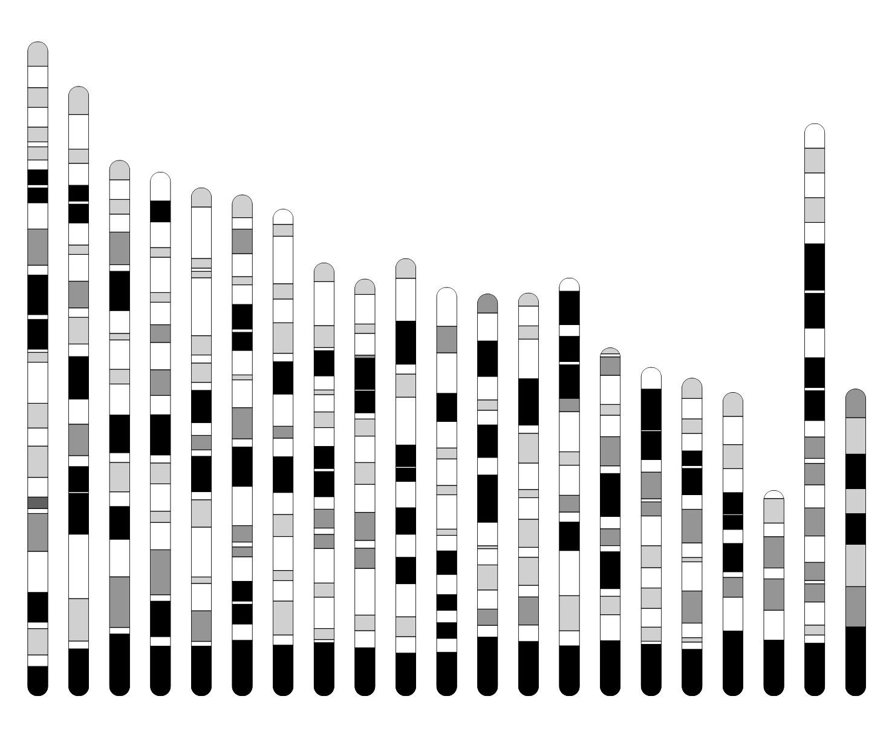
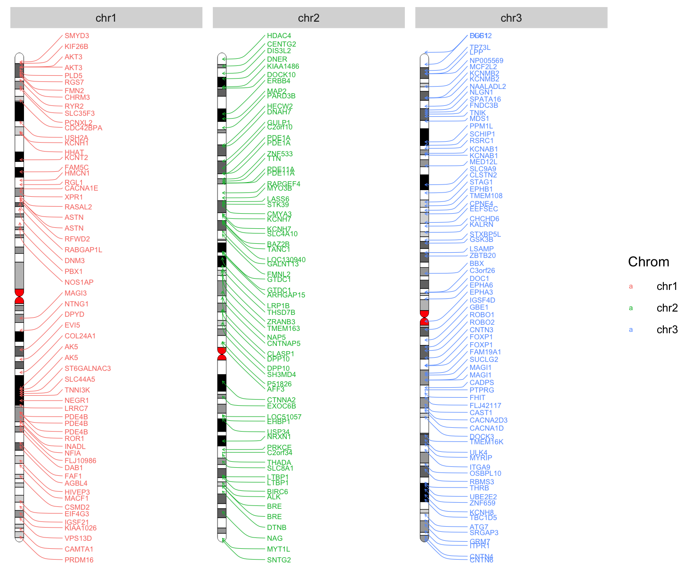
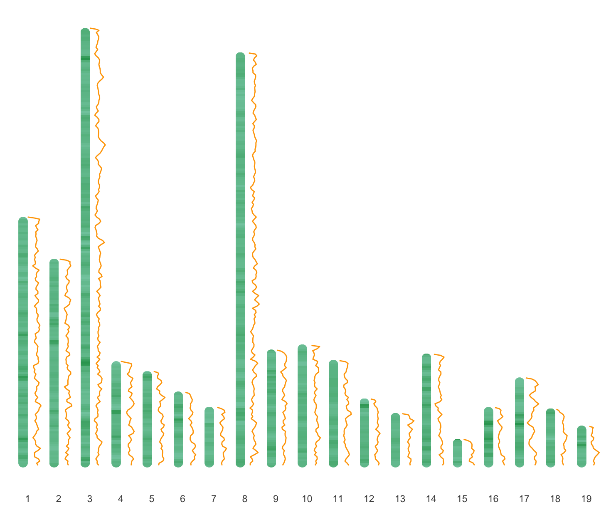
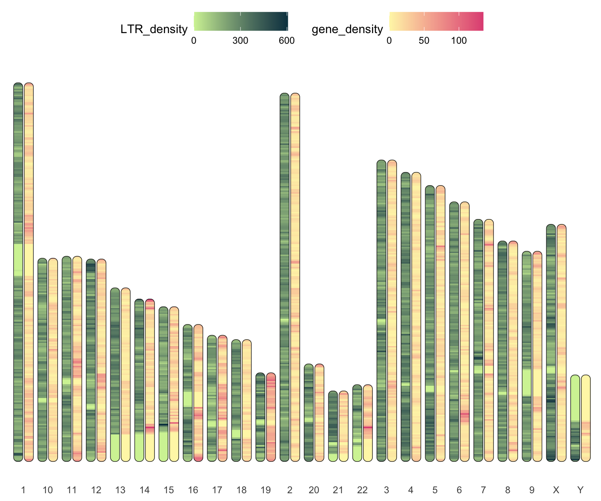

# ggideogram 

## Introduction

ggideogram is an extended ggplot2 package to draw graphics to visualize and map genome-wide data on idiograms.

## Installation

To install the package from Github, you need to install the `devtools` package first.
```r
install.packages("devtools")
library(devtools)
```

Then you can install the `ggideogram` package.
```r
devtools::install_github('TickingClock1992/RIdeogram')
```


## Usage and Examples

This is a simple package with only one geom `geom_ideogram`, and some help functions to process data.

First, you need to load the package after you installed it.

```{r}
require(ggideogram)
```

Then, you can load the data from the ggideogram package.

```{r}
data(karyotype_hg19, package="ggideogram")
head(karyotype_hg19)
#   Chrom    Start      End  Stain Arm
# 1  chr1        0  2300000   gneg   p
# 2  chr1  2300000  5400000 gpos25   p
# 3  chr1  5400000  7200000   gneg   p
# 4  chr1  7200000  9200000 gpos25   p
# 5  chr1  9200000 12700000   gneg   p
# 6  chr1 12700000 16200000 gpos50   p
data(chromosome.size.hg19, package="ggideogram")
head(chromosome.size.hg19)
# # A tibble: 6 × 3
#   Chrom Start       End
#   <fct> <int>     <int>
# 1 chr1      0 249250621
# 2 chr2      0 243199373
# 3 chr3      0 198022430
# 4 chr4      0 191154276
# 5 chr5      0 180915260
# 6 chr6      0 171115067
```

Now, let's begin.

First, we draw a idiogram using the `karyotype_hg19` data.

```r
ggplot(karyotype_hg19) +
    geom_ideogram(aes(x = Chrom, ymin = Start, ymax = End, 
                      chrom = Chrom, fill = Stain, arm = Arm), 
                  radius = unit(6, 'pt'), width = 0.5, linewidth = .2, 
                  colour = 'black', show.legend = FALSE) +
    scale_fill_manual(values = cytoband_colors) +
    theme(
        axis.title = element_blank(),
        axis.text = element_blank(),
        axis.ticks = element_blank(),
        panel.background = element_blank()
    )
```



flip the coordinate to horizontal.

```r
karyotype_hg19 %>%
    ggplot() +
    geom_ideogram(aes(x = Chrom, ymin = Start, ymax = End, 
                      chrom = Chrom, fill = Stain, arm = Arm), 
                  radius = unit(4, 'pt'), width = 0.3, linewidth = .2, 
                  colour = 'black', show.legend = FALSE) +
    scale_fill_manual(values = cytoband_colors) +
    coord_flip() +
    theme(
        axis.title = element_blank(),
        axis.text = element_blank(),
        axis.ticks = element_blank(),
        panel.background = element_blank()
    )
```



select some chromosomes to draw and show the chromosome name.

```r
karyotype_hg19 %>%
    dplyr::filter(Chrom %in% c('chr1', 'chr2', 'chr3', 'chr4', 'chr5')) %>%
    ggplot() +
    geom_ideogram(aes(x = Chrom, ymin = Start, ymax = End, 
                      chrom = Chrom, fill = Stain, arm = Arm), 
                  radius = unit(10, 'pt'), width = 0.3, 
                  linewidth = .2, colour = 'black',
                  show.legend = FALSE) +
    scale_fill_manual(values = cytoband_colors) +
    scale_y_continuous(expand = expansion(mult = c(0, 0.01))) +
    theme(
        axis.title = element_blank(),
        axis.text.y = element_blank(),
        axis.ticks = element_blank(),
        panel.background = element_blank()
    )
```



draw the gene density heatmap on the idiogram.

we need to load the gene density data from the [RIdeogram](https://github.com/TickingClock1992/RIdeogram/tree/master) package.

```r
data(gene_density, package="RIdeogram")

mutate(gene_density, Chr = factor(Chr, levels = c(1:22, 'X', 'Y'))) %>%
    ggplot() +
    geom_ideogram(aes(x = Chr, ymin = Start, ymax = End, 
                      chrom = Chr, fill = Value), 
                  radius = unit(4, 'pt'), width = 0.5, linewidth = 1,
                  show.legend = FALSE) +
    scale_fill_gradient2(low = "#6fda97", mid = "#e6f972", high = "#38acaf") +
    scale_y_continuous(expand = expansion(mult = c(0, 0.01))) +
    theme(
        axis.title = element_blank(),
        axis.text.y = element_blank(),
        axis.ticks = element_blank(),
        panel.background = element_blank()
    )
```



We can display the information of chromosomes in a stacked manner. Then, in the blank area of the panel, we show the values corresponding to the positions of the chromosomes.

```r
mutate(gene_density, Chrom = factor(Chr, levels = c(1:22, 'X', 'Y'))) %>%
    dplyr::filter(Chrom %in% c(1:3)) %>%
    put_togather(width = 5e6) %>%
    mutate(Mid = (Start + End) / 2) %>%
    ggplot() +
    geom_ideogram(aes(x = -10, ymin = Start, ymax = End, 
                      chrom = Chrom, fill = Value), 
                  radius = unit(4, 'pt'), width = 10, linewidth = 1, 
                  chrom.col = 'grey80',
                  show.legend = FALSE) +
    scale_fill_gradient2(low = "#6fda97", mid = "#e6f972", high = "#38acaf") +
    geom_line(aes(x = Value, y = Mid, colour = Chrom, group = Chrom),
              orientation = 'y') +
    theme(
        axis.title = element_blank(),
        axis.text.y = element_blank(),
        axis.ticks = element_blank(),
        panel.background = element_blank()
    )
```



Add some points which represent RNAs on the idiogram.

Use the `Random_RNAs_500` data from the `RIdeogram`

```r
data(Random_RNAs_500, package="RIdeogram")

mutate(gene_density, Chr = factor(Chr, levels = c(1:22, 'X', 'Y'))) %>%
    ggplot() +
    geom_ideogram(aes(x = Chr, ymin = Start, ymax = End, 
                      chrom = Chr, fill = Value), 
                  radius = unit(4, 'pt'), width = 0.5, 
                  linewidth = 1, chrom.col = 'grey80',
                  show.legend = FALSE) +
    scale_fill_gradient2(low = "#6fda97", mid = "#e6f972", high = "#38acaf") +
    geom_point(data = Random_RNAs_500, 
               aes(x = Chr, y = (Start + End) / 2, 
                   shape = Type, colour = Type),
               position = position_nudge(x = 0.5)) +
    scale_colour_manual(values = c("#e66760", "#8c88cd", "#69c5e4")) +
    scale_y_continuous(expand = expansion(mult = c(0, 0.01))) +
    theme(
        axis.title = element_blank(),
        axis.text.y = element_blank(),
        axis.ticks = element_blank(),
        panel.background = element_blank()
    )
```



Draw the idiogram of mm10.

```r
data(karyotype_mm10, package="ggideogram")

ggplot(karyotype_mm10) +
    geom_ideogram(aes(x = Chrom, ymin = Start, ymax = End, 
                      chrom = Chrom, fill = Stain, arm = Arm), 
                  radius = unit(6, 'pt'), width = 0.5, 
                  linewidth = .2, colour = 'black',
                  show.legend = FALSE) +
    scale_fill_manual(values = cytoband_colors) +
    theme(
        axis.title = element_blank(),
        axis.text = element_blank(),
        axis.ticks = element_blank(),
        panel.background = element_blank()
    )
```



Show gene names on the idiogram.

```r
library(ggrepel)

path <- system.file("extdata", "genes.txt", package = "ggideogram")

gene_list <- read.csv(path, sep = ' ', header = FALSE, 
                      col.names = c('Chrom', 'Start', 'End', 'Name')) %>%
    mutate(Chrom = str_replace(Chrom, 'hs', 'chr'),
           Name = str_extract(Name, '(.+)_', group = 1),
           Mid = (Start + End) / 2) %>%
    dplyr::filter(Chrom %in% c('chr1', 'chr2', 'chr3')) %>%
    distinct()


karyotype_hg19 %>%
    dplyr::filter(Chrom %in% c('chr1', 'chr2', 'chr3')) %>%
    ggplot() +
    geom_ideogram(aes(x = 1, ymin = Start, ymax = End, 
                      chrom = Chrom, fill = Stain, arm = Arm), 
                  radius = unit(4, 'pt'), width = 0.1, 
                  linewidth = .2, colour = 'black',
                  show.legend = FALSE) +
    geom_text_repel(data = gene_list, aes(x = 1, y = Mid, 
                                          label = Name, colour = Chrom), 
                    size = 2, hjust = 0, nudge_x = 0.5,
                    arrow = arrow(length = unit(0.015, "npc")),
                    direction    = "y",
                    force_pull   = 0,
                    segment.size      = 0.2,
                    segment.curvature = -0.1,
                    segment.ncp = 3,
                    segment.angle = 20) +
    scale_fill_manual(values = cytoband_colors) +
    scale_x_continuous(expand = expansion(mult = c(0, 0.01)), 
                       limits = c(0.9, 3)) +
    facet_wrap(vars(Chrom), scales = 'free') +
    theme(
        axis.title = element_blank(),
        axis.text = element_blank(),
        axis.ticks = element_blank(),
        panel.background = element_blank()
    )
```



Draw the Fst and Pi data from the `RIdeogram` package on the idiogram.

```r
data(Fst_between_CE_and_CW, package="RIdeogram")
data(Pi_for_CE, package="RIdeogram")


line.data <- mutate(Pi_for_CE, 
                    Value = (Value - min(Value)) / (max(Value) - min(Value)),
                    Mid = (Start + End) / 2)

mutate(Fst_between_CE_and_CW, Chr = factor(Chr, levels = c(1:19))) %>%
    ggplot() +
    geom_ideogram(aes(x = Chr, ymin = Start, ymax = End, 
                      chrom = Chr, fill = Value), 
                  radius = unit(4, 'pt'), width = 0.3, 
                  linewidth = 1, just = 1,
                  show.legend = FALSE) +
    geom_line(aes(x = as.integer(Chr) + Value / 2, y = Mid, group = Chr), 
              data = line.data,
              orientation = 'y', colour = 'orange') +
    scale_fill_gradient2(low = "#e5f5f9", mid = "#99d8c9", high = "#2ca25f") +
    theme(
        axis.title = element_blank(),
        axis.text.y = element_blank(),
        axis.ticks = element_blank(),
        panel.background = element_blank()
    )
```



Draw the LTR and gene density heatmap on the idiogram.

```r
data(LTR_density, package="RIdeogram")

ggplot() +
    geom_ideogram(aes(x = Chr, ymin = Start, ymax = End, 
                      chrom = Chr, fill = Value), 
                  data = gene_density,
                  radius = unit(4, 'pt'), width = 0.4, 
                  linewidth = 1, just = -0.05,
                  chrom.col = "#252525", chrom.lwd = .5) +
    scale_fill_gradient(name = "gene_density", low = "#fef6b5", 
                        high = "#e15383", n.breaks = 3) +
    ggnewscale::new_scale_fill() +
    geom_ideogram(aes(x = Chr, ymin = Start, ymax = End, 
                      chrom = Chr, fill = Value), 
                  data = LTR_density,
                  radius = unit(4, 'pt'), width = 0.4, 
                  linewidth = 1, just = 1.05,
                  chrom.col = "#252525", chrom.lwd = .5) +
    scale_fill_gradient(name = "LTR_density", low = "#d3f2a3", 
                        high = "#074050", n.breaks = 3) +
    theme(
        axis.title = element_blank(),
        axis.text.y = element_blank(),
        axis.ticks = element_blank(),
        panel.background = element_blank(),
        legend.position = 'top'
    )
```



## Note

Other species' idiograms can be drawn by the same way. If you want to draw the idiogram of other species, you can use the `karyotype` data from the `ggideogram` package or download the data from the [UCSC website](http://hgdownload.soe.ucsc.edu/downloads.html).

The `karyotype` data is a data frame with columns `Chrom`, `Start`, `End`, `Stain`(optional), `Arm`(optional), and `Chrom` is the chromosome name, `Start` and `End` are the start and end positions of the chromosome, `Stain` is the color of the chromosome, `Arm` is the arm of the chromosome. You can use the `chromosome.size` data to set the chromosome size.
